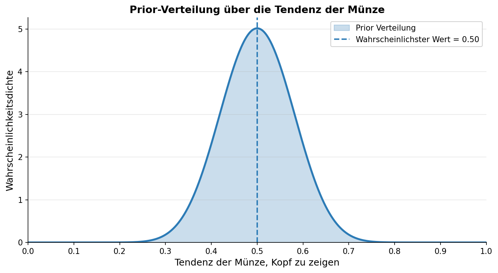
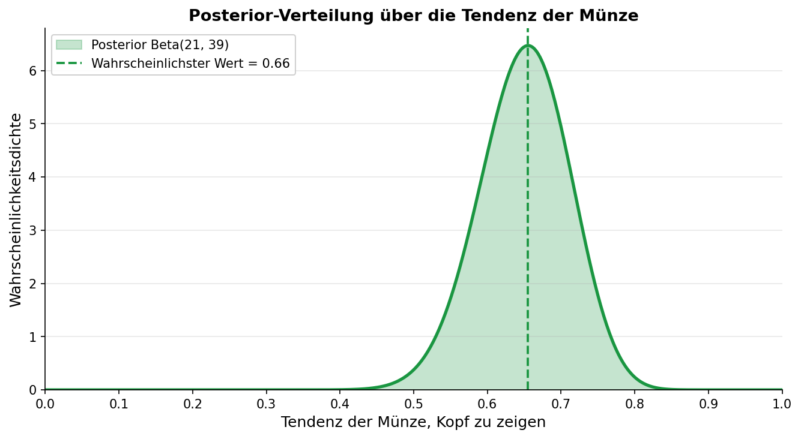

Dieses Repository ist Teil der Umfrage-Werkstattbox des Civic Data Labs (ToDo: Link). In der Werkstattbox findet ihr Infos und Hilfestellungen rund um das Thema Umfragen - von der Konzeption bis zur Auswertung.

# Statistische Auswertung von Umfragen mit Bayesscher Statistik

Dieses Repository soll es Menschen mit Coding Vorerfahrung ermöglichen sich in Bayessche Statistik einzuarbeiten. Wir werden Beispiele aus dem Bereich Umfragen behandeln um die Konzepte zu erklären.

## Wie funktioniert Bayessche Statistik?

Die grundlegende Idee in der Bayesschen Statistik ist die eigenen Vermutungen über die Welt anhand von Daten zu aktualisieren (engl. Fachbegriff: Bayesian Updating). 
Zunächst müssen wir dazu unseren Wissensstand, bevor wir die Daten zu Gesicht bekommen, beschreiben um danach dann die Aktualisierung anhand der Daten vornehmen zu können. Der Wissensstand vor dem Sehen der Daten heißt Prior oder a priori Wahrscheinlichkeit. Der Wissensstand nach dem Sehen der Daten heißt Posterior oder a posteriori Wahrscheinlichkeit.
Wie kann man einen (Un-)wissensstand mathematisch beschreiben? Mit Wahrscheinlichkeiten und Wahrscheinlichkeitsverteilungen.

### Wahrscheinlichkeitsgrundlagen

Ein Beispiel: Bevor eine Münze geworfen wird, weiß man nicht ob sie Kopf oder Zahl zeigen wird. Bei einer typischen (fairen) Münze, kann man seinen Wissensstand also so ausdrücken:    
$p(\text{Kopf})=0.5$ mit der Funktion $p()$ für probability - Wahrscheinlichkeit.    
Der eigene (Un-)wissensstand ist, "Die Wahrscheinlichkeit für Kopf ist 50%".

Wahrscheinlichkeitsverteilungen geben gleichzeitig die einzelnen Wahrscheinlichkeiten für mehrere Werte an. Bei einem typischen Würfel zum Beispiel so:  
$p(1)=p(2)=p(3)=p(4)=p(5)=p(6)=\frac{1}{6}$
Die Wahrscheinlichkeit eine eins zu würfeln ist gleich hoch wie die Wahrscheinlichkeit eine drei zu Würfeln, etc. Nämlich $\frac{1}{6}$

Wenn es um die Tendenz der Münze geht Kopf zu zeigen, also wie hoch der Anteil an Köpfen bei sehr vielen Münzwürfen typischerweise wäre, können wir das mit einer kontinuierlichen Verteilung darstellen. Diese muss Werten zwischen 0 und 1 Wahrscheinlichkeiten zuweisen. Denn der Anteil an Köpfen bei z.B. 1000 Würfen kann nur zwischen minimal $0/1000 = 0$ und maximal $1000/1000=1$ liegen. Z.B. könnte eine Prior Verteilung für die Tendenz einer Münze so aussehen:

Werte um 0.5 werden hier als sehr viel wahrscheinlicher modeliert als extreme Werte in Richtung 0 oder 1. Mit anderen Worten wir halten es a priori für sehr wahrscheinlich, dass die Tendenz der Münze Kopf zu zeigen ungefähr bei 50% liegt. Wenn die Münze bei tausenden (oder millionen) von Würfen in 45% oder 55% der Fälle Kopf zeigt, wären wir auch nicht allzusehr überrascht. Wir vermuten a priori also, dass die Münze ungefähr fair (Tendenz 50%) ist.[^dichte]

## Bayessches Updating
Wir haben diese Wahrscheinlichkeitsverteilung gerade genutzt um unsere Vermutung über eine Münze zusammen zu fassen bevor wir Daten über sie gesammelt haben. Nun stellen wir uns vor wir werfen die Münze 20 mal und schreiben auf wie oft sie Kopf oder Zahl zeigt. Mit diesen 20 Datenpunkten können wir uns nun an das Bayessche Aktualisieren unsere a priori Vermutung wagen und zu einem a posteriori Wissensstand gelangen.

Mal angenommen von den 20 Würfen zeigte die Münze 19 mal Kopf. Huch, vielleicht ist das doch gar keine faire Münze. Vielleicht ist sie auf Kopf gezinkt. Bayessche Statistik erlaubt es uns unsere initiale Vermutung über die Münze mathematisch exakt zu aktualisieren. Es gibt genau einen mathematisch-rationalen Weg die Daten über diese Münze und unsere Prior Vermutungen zusammen zu bringen und bei einer Posterior Verteilung zu landen. Diese beschreibt den (Un-)wissensstand, den ein mathematisch-rationaler Zuschauer hat, der mit unserem Prior gestartet ist und die 19 von 20 mal Kopf gesehen hat.

Wir sehen, dass die Posterior Verteilung nun nicht mehr davon ausgeht, dass die Münze vermutlich fair ist. Mit unserem aktualisierten Wissensstand sehen wir Werte um 0.66 als wahrscheinlichste Werte für die Tendenz der Münze Kopf zu zeigen.   
Wir haben 19/20 mal Kopf gesehen und dennoch ist die Wahrscheinlichkeit, für eine Tendenz um $\frac{19}{20} = 0.95$ nach wie vor sehr gering. Das liegt daran, dass der Posterior das Wissen aus dem Prior und den Daten vereint. Wenn wir tatsächlich vor den 20 Würfen geglaubt haben, dass die Münze ungefähr fair ist, dann wäre es nach 19 von 20 Köpfen übereilt sich sehr sicher zu sein, dass die Münze in Zukunft fast nur Kopf zeigen wird. Um uns davon zu überzeugen müssten wir deutlich mehr Daten sammeln. Das ist ein Vorteil der Bayesschen Statistik, der sie besonders robust macht wenn es darum geht statistische Schlüsse aus kleinen Datensätzen zu ziehen.

### Statistik und Prior-Auswahl
Im statistischen Kontext möchten wir oft von einem neutralen a priori Wissensstand ausgehen, der nur völlig unplausible Werte ausschließt. Wir wollen schließlich einen unvoreingenommenen Blick auf die Daten werfen.
Ein Beispiel: Wir wollen anhand von Daten herausfinden wie hoch der Anteil an Vereinsmitgliedern sein wird, die zum Sommerfest kommen.
Ein absolut neutraler Prior würde jedem Anteilsverhältnis zwischen 0 und 1 die gleiche Wahrscheinlichkeit geben bevor wir die Daten (zum Beispiel aus einer Umfrage) gesehen haben. Dass niemand kommt, dass genau $\frac{2}{3}$ der Leute kommen und dass wirklich alle kommen wäre also unter diesem Prior exakt gleich wahrscheinlich. Da es schon sehr unwahrscheinlich ist, dass gar niemand oder wirklich alle kommen, könnte man hier auch einen Prior wählen der diese Extreme als etwas weniger wahrscheinlich modeliert und dafür mittlere Werte (0.5; also die Hälfte der Mitglieder kommt vorbei) als etwas wahrscheinlicher darstellt. So ein Prior heißt in der Fachsprache "weakly informative", also ein Prior der ein kleines bisschen Vorwissen mit einbaut. Das ist auch der empfohlene Weg in der Bayesschen Statistik einen Prior zu wählen und wir werden hier nur solche "weakly informative" Prior benutzen.

An introduction to Bayesian statistics for survey analysis.

Bayesian statistics
- Updating knowledge with data

Difference to and advantages over frequentist statistics
- Different interpretation of probability (long-run relative frequency vs. rational
  state of mind)
- Interpretability of results (no more p-values)
- Modeling freedom
- Hierarchical models can share statistical strenght across subgroups automatically

Disadvantages of Bayes
- Problems with communicating to stakeholders who know only frequentist statistics
- Higher computational effort

## Was ist überhaupt (schließende) Statistik?

## Wie wertet man Umfragen eigentlich statistisch aus?
In diesem Repository gibt es Tutorials, die beispielhaft zeigen wie man Bayessche Statistik nutzen kann um Fragen zu beantworten wie z.B. "Wie wahrscheinlich ist die Korrelation zwischen zwei Umfrage Items positiv" oder "Wie stark unterscheiden sich die Gruppen in unserer Umfrage?"

## Kurz Intro zu Bayes
Bayessche Statistik ist ein immer populärer werdender Zweig der Statistik mit Vorteilen gegenüber klassischer Statistik.

### Interpretierbare Auswertung
Die Auswertungen können direkt Fragen zu Hypothesen beantworten, wie beispielsweise "Wie wahrscheinlich ist es, dass Gruppe A einen höheren Wert aufweist als Gruppe B?". Klassische Statistik arbeitet hier oft mit p-Werten. Diese sind sehr nützlich, aber schwer zu interpretieren[^pWert]

### Wie funktioniert Bayes?

### Vergleich zu klassischer Statistik

### Nachteile von Bayes

### Bayesscher workflow
Model definieren
Prior predictive check
Model fitten
Check von MCMC Approximation
Posterior predictive check
Auswertung des posteriors (credible intervals, posterior of direction etc.)

## Data format
Long 

[^pWert]: Die korrekte Interpretation eines p-Werts ist: "Wie wahrscheinlich sind die gegebenen Daten oder noch extremere Daten unter der Annahme, dass die Nullhypothese wahr ist?" Wenn diese Wahrscheinlichkeit klein ist (üblicherweise unter 5%), dann wird die Nullhypothese abgelehnt. Eine direkte Aussage über die Wahrscheinlichkeit, dass die Nullhypothese falsch ist oder dass eine Alternativhypothese richtig ist, ist in der klassischen Statistik nicht möglich.

[^dichte]: Wer genau hingeschaut hat, hat vielleicht gesehen, dass hier nicht die Wahrscheinlichkeit sondern die Wahrscheinlichkeitsdichte geplottet wurde. Bei kontinuerlichen Verteilungen ist das typischerweise der Fall. Jeder einzelne genaue Wert zwischen 0 und 1 ist extrem unwahrscheinlich. Was ist die Wahrscheinlichkeit, dass die Tendenz der Münze genau 0.44389209 ist? Genau 0. Sinnvolle Wahrscheinlichkeiten lassen sich bei kontinuierlichen Verteilungen nur für Intervalle angeben. Die Wahrscheinlichkeit, dass die Tendenz der Münze zwischen 0.4 und 0.6 liegt ist bei diesem Prior beispielsweise ca. 80%. Wahrscheinlichkeitsdichte lässt sich also gut plotten. Zu echten Wahrscheinlichkeiten kommt man wenn man die Dichte über ein Interval integriert.

## KI Disclaimer
Bei der Erstellung dieses Repositories haben wir Language Models genutzt und zwar für diese Aufgaben:
- Doc Strings
- Plotting Funktionen